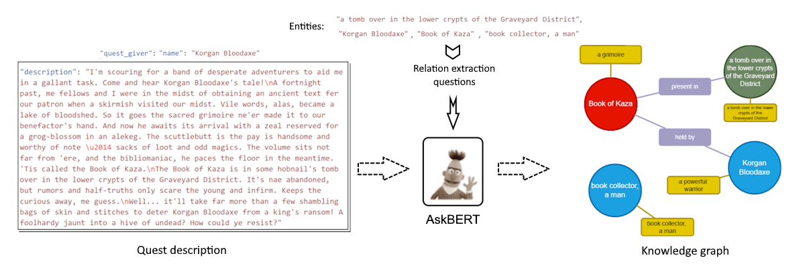
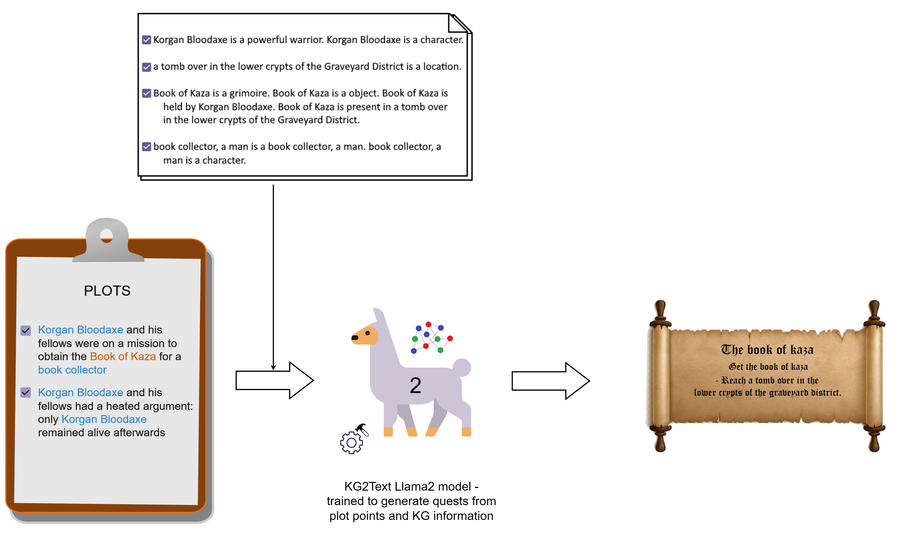

# Generating Video Game Quests From Stories

This repository contains the code and data used in my MSc thesis. The thesis is about generating video game quests from stories. The code is written in Python and uses the PyTorch library. The data is a collection of stories and quests from video games. The final published thesis report is available on the [University of Twente repository](https://essay.utwente.nl/97909/).

## Abstract

With the increasing interest in story based video games, there is a surge of new titles based on existing stories or narrative worlds. Game development is a notoriously challenging job and this project aims to streamline the workflow by automating quest generation from existing narratives. The narrative plot points and the relations between the included characters, locations and objects form the crucial story elements. This thesis delves into the incorporation of world knowledge as knowledge graphs (KGs) in quest generation in video games from story plot points. Knowledge graphs capture the intricate dependencies between the entities in a narrative world and this information is leveraged in generating quests. The primary focus lies in examining the impact of incorporating KG data on the quality and relevance of generated quests, an area that remains relatively unexplored in the field of automated game design. Through a methodical approach, this study evaluates the impact of incorporating knowledge graphs for quest generation. The findings reveal a significant improvement in quest quality with the inclusion of KG data when compared to those generated without the KG data. The similarity of generated quests with the actual quest is also assessed by changing the amount of included KG data.

**Keywords**: LLMs, Knowledge Graphs, Video games, Quests, NLG, Stories, Llama2

## Data

The data used in this project is a collection of stories and quests from various video games and other sources. The final raw dataused  is available in the [`data`](/data/) directory. The data used to fine-tune the Llama2 model was compiled by [Värtinen et al.](https://doi.org/10.1109/TG.2022.3228480)and is formatted to contain all quests together for this project, available [here](/data/VartinenFormatted/all_quests.json). The data formatted for Llama2 is present in the `data` dirtectory in the `/quest_generation/llama2/` submodule.

## Story element extraction and KG Construction

The `KG_construction/LLMs/worldGenKG/` submodule contains the scripts and the model used to extract story elements and construct the KGs. The KGs are constructed using the AskBERT model for each game in the dataset, employing the methods outlined by [Ammanabrolu et al.](https://doi.org/10.48550/arXiv.2001.10161)

## Quest Generation

The quest generation code is present in the `quest_generation/llama2` submodule. The code uses the [Llama2 13B model](https://huggingface.co/docs/transformers/model_doc/llama2) to generate quests from the story elements and KGs. The code is written in Python and uses the PyTorch library. The Llama2 model was fine-tuned using state-of-the-art parameter efficient fine-tuning techniques (PEFT) including 4-bit quantization and Low rank adoptation ([QLoRA](https://github.com/artidoro/qlora)). The model was fine-tuned on an NVIDIA RTX 4080 GPU with 16GB VRAM.

The fine-tuning script follows [@facebookresearch's Llama fine-tuning guide](https://github.com/facebookresearch/llama-recipes/blob/main/examples/quickstart.ipynb), using the [🤗 huggingface transformers library](https://huggingface.co/). 

Two models were trained:

### No KG model

The No KG model was trasined to generate quests directly from the story plot points as shown below:

### KG model

The KG model was trasined to generate quests from the story plot points by including the entities and the relations betwen them in textual format from the constructed KGs as shown below:

## Evaluation and results

[`evaluation`](/evaluation/) contains the results and findings from the experiments conducted in the thesis. The [final report](/Mishra_MA_EEMCS.pdf) and [presentation](Manish%20-%20Final%20Presentation.pptx) is present in the root directory.

The evaluation was done to compare the differences in the generated quests with and without KG data using an online evaluation survey on a 5-point Likert scale. The survey contained 10 questions, each with quests witth and without KG data. The participants were asked to provide their preference for which quest they found more relevant and interesting.

Then, the participants were also asked to rate the quests on the following factors on a 5-point Likert scale:

- **Relatedness**: "The quest is related to the given story" - Evaluating if the quest is relevant to the provided story.
- **Contradiction**: "The quest contains contradictory statements with respect to the story shown" - Determining if the quest contains statements that contradict the story.
- **Coherence**: "The quest follows the shown storyline consistently" - Assessing the consistency of the quest with the storyline.
- **Value**: "The quest contributes to progressing further in the given story" - Judging the quest’s alignment to the story plot progression.

## Contributions

The contributions of this research are two-fold:
1. Firstly, a systematic and reproducible quest generation framework is provided. This framework is capable of generating quests using three fundamental elements: the narrative plot points, controllable levels of world knowledge from knowledge graphs, and a quest generation model, which
is a state-of-the-art LLM, fine-tuned to generate quests using the previous elements.
1. Secondly, the dataset provided by [Värtinen et al.](https://doi.org/10.1109/TG.2022.3228480) is now augmented with a complete world knowledge graph for each of the games in the dataset. These knowledge graphs are extracted using the quest descriptions and the identified entities.

## Conclusion
The aim of this thesis was to assess the impact of including world knowledge on the quality of quest generation using story plot points. After following a literature study, creating a quest generation framework, experimenting with controllable amounts of knowledge incorporation in quest generation and evaluating the results, it can be concluded that integrating world knowledge improves the quality of quests generated from narrative plot points. Including information about the entities mentioned directly in the plot points generate quests which are most similar to actual quests. The quests generated with the inclusion of world knowledge are perceived to be more related and coherent with the background story plot and contribute more to the story progression value. Moreover, the quests generated without the inclusion of world knowledge tend to contain more contradictory statements. Potential improvements to the quest generation framework are also suggested, which could help game developers streamline the processes of creating quests that stay true to the overarching game narrative.